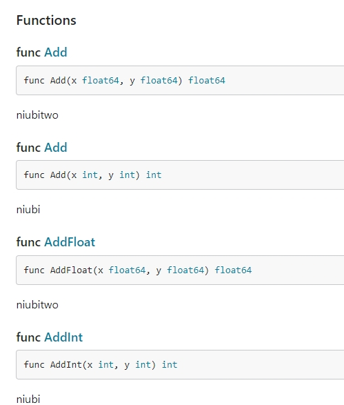
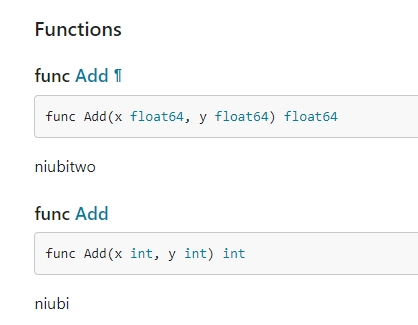

# OverLoad Func Display Design

## Plan 1

Keep the original functions and add new overloaded functions

## Plan 2

Keep overloaded function names

## Plan 3

Displayed in Go + syntax and clickable to jump. But you need to add a new template

`func Add = (
AddInt(x int, y int) // Click to jump
AddFloat64(x float64, y float64)
)`